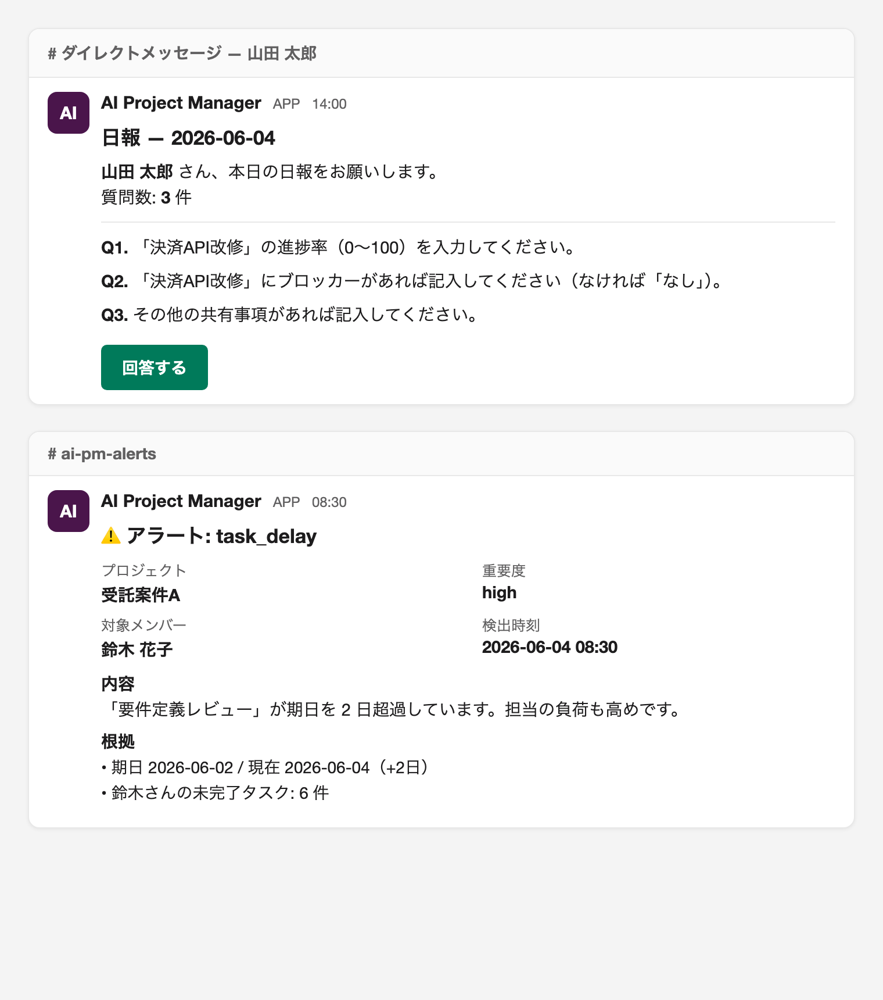
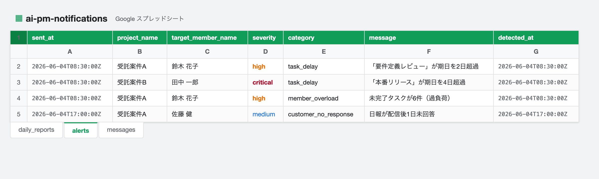
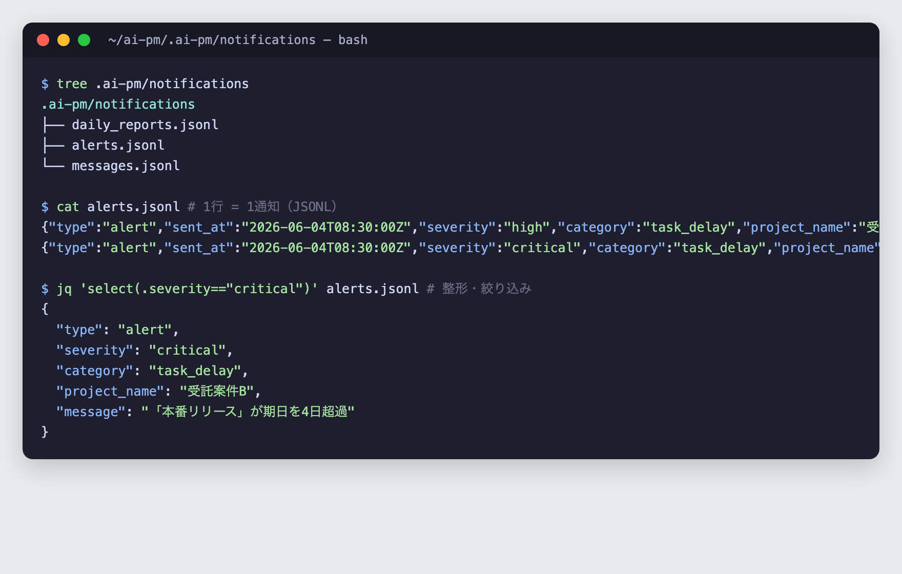

# 出力先（通知チャネル）

AI-PM の出力先（日報・スタンドアップ・催促・総括・アラート等の配信先）は
`NOTIFICATION_CHANNEL` で選びます。**選択肢ごとに「どこに・どんな形で出るか」「リーダーが
どこを見るか」「メンバーのメリット」が大きく違う**ので、ここで詳しく解説します。

!!! abstract "要約"
    - 選べるのは **`slack` / `google_sheets` / `local_file` / `in_memory`** の **1 つ**（同時併用ではない）。
    - 設定不足時は安全に**フォールバック**します（`指定 → local_file → in_memory`）。
    - **対話性・即時性が要るなら Slack**、**一覧・集計で見たいなら Google Sheets**、**まず安全に立ち上げる/監査ログなら local_file**。

---

## 何が配信されるか（共通）

出力先に関わらず、AI-PM は次の 3 種類の通知を送ります。

| 通知 | 中身 | 既定の宛先 |
|---|---|---|
| **日報インバイト** | その日の質問（進捗率・ブロッカー等）と回答導線 | 各メンバー（DM / 個別チャネル） |
| **アラート** | タスク遅延・過負荷・日報未回答などの検知（重要度・根拠つき） | リーダー/PM のチャネル（例 `#ai-pm-alerts`） |
| **汎用メッセージ** | スタンドアップ・催促・総括・全体ステータス・リーダー確認ゲート | リーダーチャネル or メンバー DM |

出力先（Notifier）はこの 3 つを、それぞれの形式に変換して配信します。

!!! warning "出力先は「ログ」、提出状況の真実は「アプリ」"
    どの出力先も **AI-PM が外向きに送った通知を記録する一方向の出力**です。**メンバーの回答（提出）はここには入りません**。
    日報の提出は API（`POST /track/submit-responses`）で受け取り、**提出済み/未提出は AI-PM の DB**（日報ステータス `pending → delivered → submitted → analyzed`）で管理されます。
    Slack は「回答する」ボタンで対話的に回せますが、**Google Sheets / local_file は出力ログのみ**で、メンバーへ直接プッシュはしません。
    未提出は **17:00 の催促**が判定して通知に出します（[Google Sheets での提出判定](#sheets-submission)・[Track の日報ライフサイクル](capabilities.md)）。

---

## `slack` — リアルタイム・対話的（おすすめ：チームが Slack 運用）

Slack の Bot として、整形済みメッセージ（Block Kit）をチャンネル / DM に投稿します。

=== "どう出るか"

    { loading=lazy }

    *Slack での見え方（イメージ）。上＝メンバー DM の日報、下＝`#ai-pm-alerts` のアラート。*

    - **日報**: メンバーの DM に「📋 本日の日報」ヘッダ + 質問が `Q1. … / Q2. …` と並び、**「回答する」ボタン**（回答フォームURLがある場合）。
    - **アラート**: リーダーのチャネルに重要度の絵文字（🚨 critical / ⚠️ high / ℹ️ medium）+ プロジェクト/重要度/対象メンバー/検出時刻のフィールド + **根拠（evidence）**。
    - **総括・確認ゲート等**: タイトル + 本文 + **「確認する」ボタン**（`action_url` があれば、リーダーが確認操作へ直行）。
    - 一過性エラー（レート制限等）は**指数バックオフで最大3回リトライ**。

=== "リーダーはどこを見るか"

    - 普段は**アラート用チャネル（例 `#ai-pm-alerts`）を見るだけ**でよい。鳴ったら根拠つきで届く。
    - 総括・確認ゲートはボタンから確認操作へ。`final_analysis`（全体分析）はリーダーの確認後に発火。

=== "メンバーのメリット"

    - **DM に直接届き、ボタンで回答**できる。催促も Slack で来るので**取りこぼしにくい**。
    - 既存の Slack 運用にそのまま溶け込む（新しい画面を覚えなくてよい）。

=== "設定"

    ```env
    NOTIFICATION_CHANNEL=slack
    SLACK_BOT_TOKEN=xoxb-...                 # api.slack.com/apps → OAuth & Permissions
    SLACK_NOTIFICATION_CHANNEL=#ai-pm-alerts # アラート既定チャネル
    ```
    Bot に `chat:write` 権限と、投稿先チャンネルへの招待が必要です。各メンバーの宛先は
    登録（`/register`）の `external_id`（Slack ユーザーID / チャネル）から解決され、
    未設定なら既定チャネルにフォールバックします。

!!! warning "トークン未設定時"
    `SLACK_BOT_TOKEN` が空のまま `slack` を選ぶと、後方互換のため **`in_memory`**（どこにも出ない）になります。
    立ち上げ時は `local_file` を選ぶ方が安全です。

---

## `google_sheets` — 一覧・集計で見たい（おすすめ：非エンジニアの PM）

通知ごとに、指定スプレッドシートへ **1 行ずつ追記**します。シート（タブ）は自動作成されます。

=== "どう出るか"

    { loading=lazy }

    *Google スプレッドシートでの見え方（イメージ）。`alerts` タブに 1 通知＝1 行で蓄積され、フィルタ・並べ替え・集計ができます。*

    スプレッドシートに 3 つのタブができ、各通知が 1 行として積み上がります。

    | タブ | 主な列 |
    |---|---|
    | `daily_reports` | sent_at / member_name / member_channel / report_date / project_id / question_count / submit_url |
    | `alerts` | sent_at / alert_id / project_name / target_member_name / severity / category / message / detected_at |
    | `messages` | sent_at / kind（standup/reminder/wrap_up/status/gate）/ channel / title / body / action_url |

=== "リーダーはどこを見るか"

    - **スプレッドシートを開いて、フィルタ/並べ替え/ピボット**で見る。
    - 例: `alerts` タブを severity=critical でフィルタ → 今日の要対応だけ抽出。`daily_reports` で提出状況を一覧。
    - Google スプレッドシートの共有・グラフ・集計関数がそのまま使えるので、**週次レポートや進捗ダッシュボード化**に向く。

=== "メンバーのメリット"

    - 直接の DM 通知ではないため、メンバーへの即時プッシュは弱い（Slack ほどの取りこぼし防止はない）。
    - ただし**全員が同じ表を見られる**ので、進捗の透明性が高い。Slack を使っていないチームでも共有ビューを持てる。

=== "設定"

    ```env
    NOTIFICATION_CHANNEL=google_sheets
    GOOGLE_SERVICE_ACCOUNT_JSON=/path/to/service-account.json  # サービスアカウント鍵
    GOOGLE_SHEET_ID=<スプレッドシートID>                        # 対象シートを SA と共有しておく
    ```
    `gspread` が必要です。設定不足時は **`local_file` にフォールバック**します。

!!! tip "Slack と併用したい場合"
    出力先は 1 つだけですが、「メンバーには Slack で催促、リーダーは集計を見たい」場合は
    Slack を主にしつつ、別途バックアップとして `local_file` の JSONL を集計に回す運用も可能です。

### Google Sheets で日報の提出をどう判定するか { #sheets-submission }

`google_sheets` を選ぶと、日報は次のように扱われます。**シートは「配信ログ」であって「回答フォーム」ではない**点が肝です。

**日報の出力（`daily_reports` タブ）**

14:00 の配信ジョブが、メンバーごとに 1 行追記します。記録されるのは「**配信した事実**」で、列は
`sent_at / member_name / member_channel / report_date / project_id / question_count / submit_url`。

!!! warning "シートに入らないもの"
    - **質問の本文**（`question_count`＝質問数だけ）
    - **メンバーの回答内容**
    - **提出済みかどうか**（ステータスは入らない）

**提出（submitted）の判定**

提出状況は**シートではなく AI-PM の DB**（日報ステータス `pending → delivered → submitted`）が一次情報です。

| 状態 | 意味 |
|---|---|
| `delivered` | 配信済み・**未提出**（催促・アラートの対象） |
| `submitted` | メンバーが回答を送信（`POST /track/submit-responses`） |

- メンバーの提出は API で受け取ります。**google_sheets モードではメンバーへ直接プッシュしない**ので、回答導線（API / 別途共有したフォーム等）は運用側で用意します。
- **未提出 = ステータスが `pending` または `delivered`（＝ `submitted` でない）**。これは **17:00 の催促ジョブ**が判定します。

**リーダーが未提出を確認する場所**

17:00 の催促は、リーダー宛に「未提出者一覧」を `send_message` で送ります。`google_sheets` では **`messages` タブ**に次の行が残ります。

| 列 | 値（例） |
|---|---|
| `kind` | `reminder` |
| `title` | `日報未提出者（2026-06-04）2名` |
| `body` | `以下のメンバーが未提出です。\n・鈴木 花子\n・佐藤 健` |

!!! note "まとめ"
    - `daily_reports` タブ … **誰に配信したか**（提出有無は分からない）
    - `messages` タブ（`kind=reminder`）… **17:00 時点の未提出者一覧**
    - **リアルタイムの提出状況**は API / Overview（アプリ側）が一次情報

    「提出状況をプッシュで取りこぼしなく回したい」なら **Slack**（「回答する」ボタンで対話的）が向いています。

---

## `local_file` — まず安全に立ち上げ / 監査ログ（おすすめ：初期導入・PoC）

各通知を **JSONL（1 行 = 1 通知）** でローカルディレクトリに追記します。外部サービス不要で**必ず動く**ため、フォールバック先でもあります。

=== "どう出るか"

    { loading=lazy }

    *ターミナルでの見え方（イメージ）。`alerts.jsonl` は 1 通知＝1 行の JSONL で、`jq` で整形・絞り込みできます。*

    `NOTIFICATION_LOCAL_DIR`（既定 `./.ai-pm/notifications`）に 3 ファイル:

    ```
    .ai-pm/notifications/
      ├─ daily_reports.jsonl   # 日報インバイト
      ├─ alerts.jsonl          # アラート
      └─ messages.jsonl        # スタンドアップ/催促/総括/ゲート等
    ```

    1 行の例（alerts.jsonl）:
    ```json
    {"type":"alert","sent_at":"2026-06-04T08:00:00Z","severity":"high","category":"task_delay","message":"...","target_member_name":"山田","detected_at":"..."}
    ```

=== "リーダーはどこを見るか"

    - サーバ上のファイルを直接見る（`tail -f`、エディタ、または `jq` で整形・集計）。
    - 例: `jq 'select(.severity=="critical")' .ai-pm/notifications/alerts.jsonl`
    - GUI のプッシュ通知ではないので、**「能動的に見にいく」運用**になる。

=== "メンバーのメリット"

    - メンバーへの直接通知はない（DM 等は飛ばない）。**まず仕組みを安全に回す / 監査記録を残す**用途。
    - 本番でメンバーに届けたくなったら Slack へ切り替える、という段階的導入の出発点に最適。

=== "設定"

    ```env
    NOTIFICATION_CHANNEL=local_file
    NOTIFICATION_LOCAL_DIR=./.ai-pm/notifications   # 任意
    ```

---

## `in_memory` — テスト用

メモリ上に保持するだけで、どこにも永続化・配信しません。**CI / テスト / 疎通確認**専用です。
実運用では使いません（`slack` をトークン無しで選ぶと後方互換でこれになります）。

---

## どれを選ぶか（判断基準）

| 観点 | `slack` | `google_sheets` | `local_file` |
|---|---|---|---|
| 即時性 / プッシュ | ◎ DM・チャネル | △ 見にいく | △ 見にいく |
| 対話（ボタン回答） | ◎ | × | × |
| 一覧・集計・共有ビュー | △ | ◎ スプレッドシート | △ jq 等 |
| 非エンジニアの見やすさ | ◎ | ◎ | △ |
| 取りこぼし防止 | ◎ 催促が届く | △ | △ |
| 導入の手軽さ | △ トークン要 | △ SA 要 | ◎ 即動く |
| 監査ログ | △ | ○ 行履歴 | ◎ JSONL |
| 用途 | 本番のチーム運用 | 進捗ダッシュボード/PM | 初期導入・PoC・監査 |

!!! tip "おすすめの進め方"
    1. **まず `local_file`** で安全に立ち上げ、3 ファイルの中身で「どんな通知が・いつ出るか」を把握。
    2. メンバーにも届けたくなったら **`slack`** へ。催促・確認ゲートが Slack で回り始める。
    3. PM が一覧・集計で見たいなら **`google_sheets`**（または Slack + 集計用に local_file を併走）。

設定 UI（`/settings`）からも変更でき、各項目に取得手順のヒントが付いています
（[設定 GUI](gui.md)）。能力ごとの動作は [7 つの能力](capabilities.md) を参照してください。
