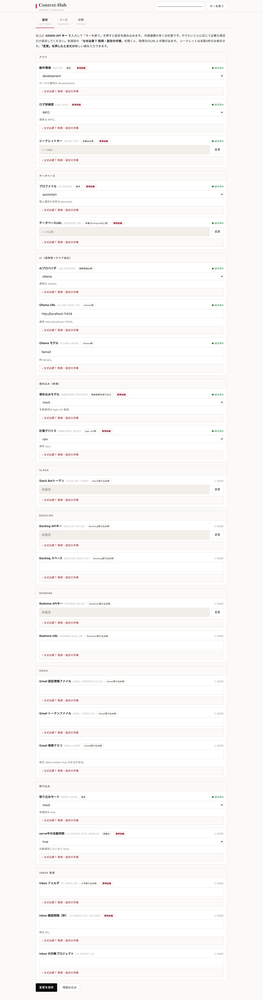
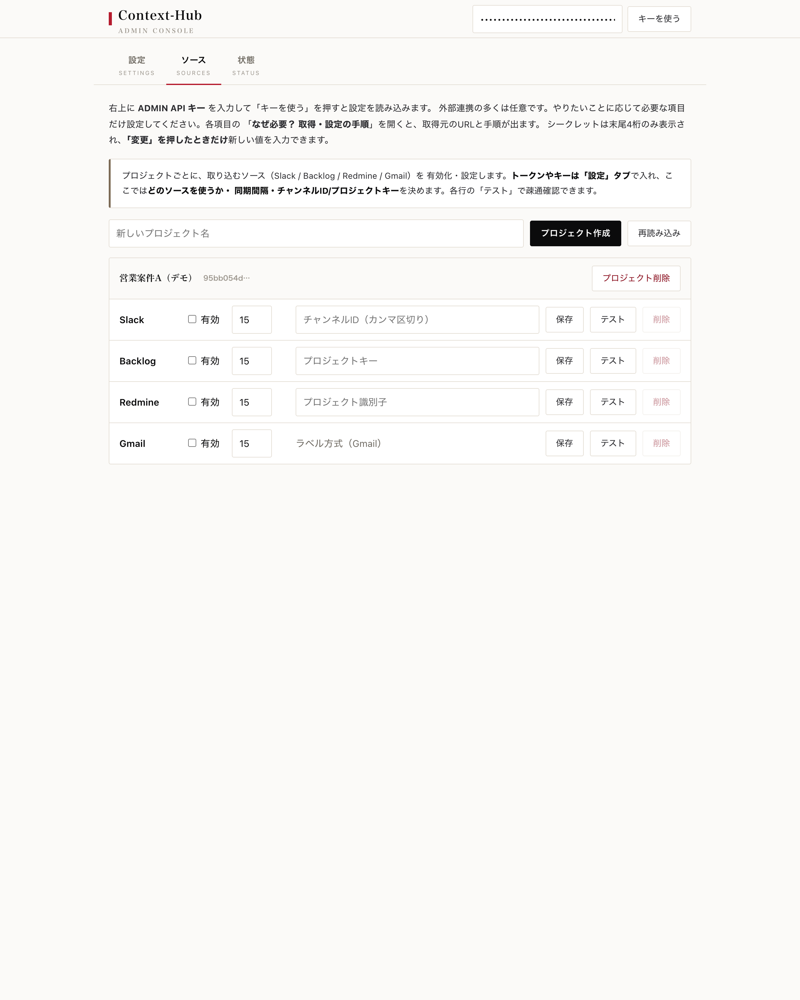
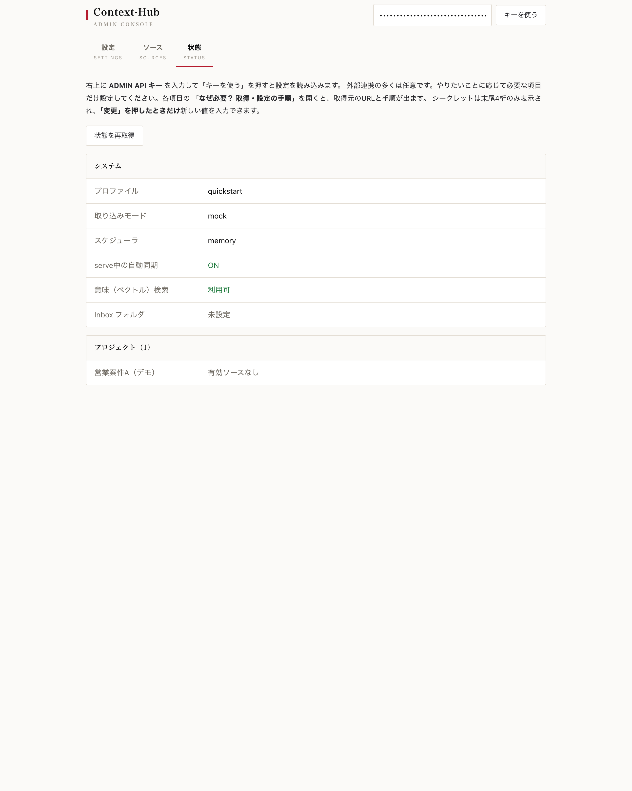

# 設定GUI（/admin）

!!! abstract "要約"
    `context-hub serve` を起動すると、ブラウザから設定できる管理コンソールが **`http://127.0.0.1:8000/admin`** で開きます。ビルド不要のサーバレンダリング 1 ページ・日本語 UI で、**Settings（設定）/ Sources（ソース）/ Status（状態）** の 3 タブを持ちます。ページ枠自体は未認証で開きますが、すべてのデータ呼び出しに **ADMIN API キー**を要求します。開発（`quickstart` / `personal`）では `init` が発行した **`DEV_API_KEY`** を、`production` では発行した **consumer キー**を貼り付けて使います。

---

## 開き方

```bash
context-hub serve            # HTTP REST API（Admin GUI もこの上で動く）
open http://127.0.0.1:8000/admin
```

右上に **ADMIN API キー**を入力して「キーを使う」を押すと設定が読み込まれます。キーはブラウザに保存され、各データ呼び出しに添付されます。

!!! warning "localhost のみで使う"
    Admin GUI は資格情報を読み書きします。`127.0.0.1` バインドでのみ運用してください。ページ枠は未認証で表示されますが、`GET/PUT /api/v1/config`・`POST /api/v1/config/test/{source}`・`GET /api/v1/status`・`/api/v1/projects` 配下の各データ呼び出しはすべて ADMIN スコープのキーを要求します。

## 認証キー

| プロファイル | 使うキー | 入手方法 |
|---|---|---|
| `quickstart` / `personal`（開発） | `DEV_API_KEY` | `init` の出力に表示／`grep DEV_API_KEY .env` |
| `production` | ADMIN スコープの consumer キー | 別途発行（`DEV_API_KEY` は無視される。`SECURITY.md` 参照） |

!!! tip "キーが分からないとき"
    開発プロファイルなら、`init` 出力の `Admin GUI key (DEV_API_KEY): ...` 行を控えるか、作業ディレクトリで `grep DEV_API_KEY .env` を実行してください。インストール手順は [インストール](install.md) を参照。

## Settings タブ（設定）



すべての接続設定とシークレットを 1 画面で編集します。Slack / Backlog / Redmine / Gmail / LLM / 埋め込み / DB / Inbox などを扱います。

- **シークレットはマスク表示**（末尾 4 文字のみ）。保存すると `.env` に書き込まれ、再起動不要な値はホットリロードされます。再起動が必要なフィールドにはバッジが付きます。
- 各項目に **「なぜ必要？ 取得・設定の手順」**（なぜ必要 / 取得手順 / 設定方法）の折りたたみガイドが付き、トークンの取得元 URL と手順まで画面内で完結します。
- バックエンドは `GET /api/v1/config`（読み取り）/ `PUT /api/v1/config`（保存）。

!!! note "外部連携は多くが任意"
    やりたいことに応じて必要な項目だけ設定すれば十分です。まず試すだけなら何も設定せず `quickstart` のまま動かせます。

## Sources タブ（ソース）



プロジェクトを作成し、各ソース（Slack / Backlog / Redmine / Gmail）の **有効化・同期間隔・Slack チャンネル ID・Backlog/Redmine のキー**などを、DB を直接触らずに設定します。

- **トークンやキーは Settings タブで入力**し、ここでは「どのソースを使うか・どの間隔で回すか」を設定します。
- 各ソースに **「Test」ボタン**があり、設定の readiness チェックに加え、Slack（`auth.test`）と Redmine（`users/current.json`）はライブ ping を実行します。
- バックエンドはプロジェクト/ソースの CRUD（`POST /api/v1/projects`、`PUT/DELETE /projects/{id}`、`PUT/DELETE /projects/{id}/sources/{type}`、`GET /projects/detailed`）と `POST /api/v1/config/test/{source}`。

## Status タブ（状態）



システムとプロジェクトの状態スナップショットを読み取り専用で表示します。

- アクティブな**プロファイル**、**取り込みモード**、**スケジューラ**、**自動同期（auto-sync）**の有無
- **ベクトル検索 vs FTS-only**（`sqlite-vec` が読めずデグレードしていないか）
- **Inbox フォルダ**の設定
- **プロジェクトごとの有効ソース**一覧
- バックエンドは `GET /api/v1/status`。

!!! tip "関連ページ"
    各タブが操作する API の詳細は [REST / MCP API](api.md)、プロファイルの意味は [プロファイル](profiles.md)、ソース接続の中身は [データ取り込み](ingest.md) を参照してください。
