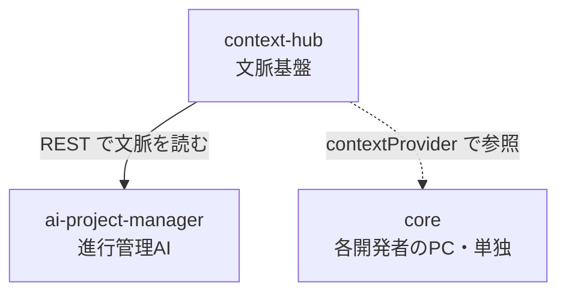

# 3 製品の全体像

余白フォース Suite は、独立して使える 3 製品で構成されます。**役割と依存関係**を押さえると、
導入順と「どれを入れるべきか」が明確になります。

---

## 役割と形態

| 製品 | 役割 | 形態 | 配布 | 依存 |
|---|---|---|---|---|
| **core**（CLI `yohaku`） | Salesforce メタデータ → 設計書を生成 | npm グローバル | PyPI 不要・npm 公開 | なし（単独で動く） |
| **context-hub**（CLI `context-hub`） | 顧客データを集める文脈基盤（サーバ） | PyPI パッケージ | `pip` / `pipx` | なし |
| **ai-project-manager** | 進行管理 AI | GitHub 公開リポ + Docker | git clone | **context-hub に依存** |

---

## 依存関係と導入順

- **導入順は「① context-hub → ② ai-project-manager」**。ai-project-manager は context-hub を参照するため。
- **core はいつ入れてもよい**（独立）。各開発者が自分の PC に入れて使う。

!!! note "連携の肝"
    core の `.yohaku/config.json` の `contextProvider` を **共有 context-hub の URL** に向けると、
    Salesforce 設計を「チームで共有された最新コンテキスト」を踏まえて行えます。
    詳しくは [core 設定](../core/configuration.md) と [バージョン管理戦略](../strategy/version-control.md) を参照。

---

## どれを入れるべきか

- **Salesforce の設計書を自動生成したい** → **core** だけで完結。
- **顧客データ（Slack/Backlog 等）を AI が参照できる文脈にまとめたい** → **context-hub**。
- **朝会・日報・総括などの進行管理を AI に任せたい** → **context-hub + ai-project-manager**。

---

## データの境界（重要な前提）

3 製品は **「顧客の生データを外部 API / SaaS に出さない」** を共通の設計境界にしています。

- context-hub: 取り込んだ顧客データは**ローカル（オンプレ）**に保存。AI へは MCP/REST で文脈として渡す。
- ai-project-manager: context-hub から受け取るのは抽象化された構造化データ。LLM はサブスク CLI かローカルで動かす。
- core: LLM を呼ばず決定的に生成。LLM 充填が要る箇所は利用者の Claude Code（サブスク）が行う。

この境界は、後述の [チーム共有戦略](../strategy/version-control.md) でも重要になります
（＝顧客データを Git に載せない）。

[:octicons-arrow-right-24: クイックスタート（導入手順）へ](install.md)
