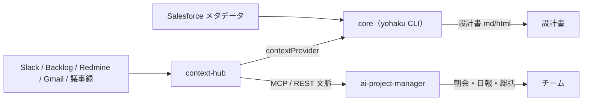

# yohakuforce Help

**余白フォース Suite** の公式ヘルプへようこそ。Salesforce 開発チームのための 3 製品 ——
**core**（設計書生成 CLI）、**context-hub**（文脈基盤）、**ai-project-manager**（進行管理 AI）——
の導入・機能・運用戦略をまとめています。

---

## 3 製品を 1 分で

-   :material-cube-outline:{ .lg .middle } **core**

    ---

    Salesforce のメタデータを知識グラフ化し、**決定的に Markdown / HTML 設計書**を生成する CLI（`yohaku`）。LLM を呼ばず「出所」を管理する足場。

    [:octicons-arrow-right-24: core を見る](core/index.md)

-   :material-database-outline:{ .lg .middle } **context-hub**

    ---

    Slack / Backlog / Redmine / Gmail / 議事録を取り込み、**MCP と REST で AI に文脈を提供**するローカル基盤。顧客データはオンプレに留まる。

    [:octicons-arrow-right-24: context-hub を見る](context-hub/index.md)

-   :material-robot-outline:{ .lg .middle } **ai-project-manager**

    ---

    context-hub の文脈を読み、**朝会・日報・総括など 7 つの能力**で進行管理する AI。サブスク / ローカル LLM で動作。

    [:octicons-arrow-right-24: ai-project-manager を見る](ai-project-manager/index.md)

---

## 目的別ナビ

-   :material-star-outline:{ .lg .middle } **ベストプラクティスで使いたい**

    ---

    3 製品を推奨構成で導入〜連携〜運用。4 週ロードマップ・1 日の時間割つきの実践プレイブック。

    [:octicons-arrow-right-24: 導入プレイブック](playbook/best-practice.md)

-   :material-rocket-launch-outline:{ .lg .middle } **まず導入したい**

    ---

    3 製品の関係と導入順、最短セットアップ手順。

    [:octicons-arrow-right-24: クイックスタート](getting-started/install.md)

-   :material-sitemap-outline:{ .lg .middle } **チームで共有したい**

    ---

    何を Git で管理し、何を共有サービスで持つか。無料・セキュアな戦略。

    [:octicons-arrow-right-24: バージョン管理 / チーム共有](strategy/version-control.md)

-   :material-map-marker-path:{ .lg .middle } **プロジェクトに展開したい**

    ---

    段階的な導入ステップと、現場で失敗しないための勘所。

    [:octicons-arrow-right-24: プロジェクト導入戦略](strategy/adoption.md)

-   :material-lifebuoy:{ .lg .middle } **困ったとき**

    ---

    よくあるつまずきと解決法、FAQ、用語集。

    [:octicons-arrow-right-24: トラブルシューティング](reference/troubleshooting.md)

---

## 全体像

- **core** は単独で動く Salesforce 開発ツール（各開発者の PC）。
- **context-hub** は文脈の基盤。core も AI も、ここを参照する。
- **ai-project-manager** は context-hub に依存して進行管理を行う。

!!! tip "はじめての方へ"
    まずは [3 製品の全体像](getting-started/overview.md) → [クイックスタート](getting-started/install.md) の順がおすすめです。
