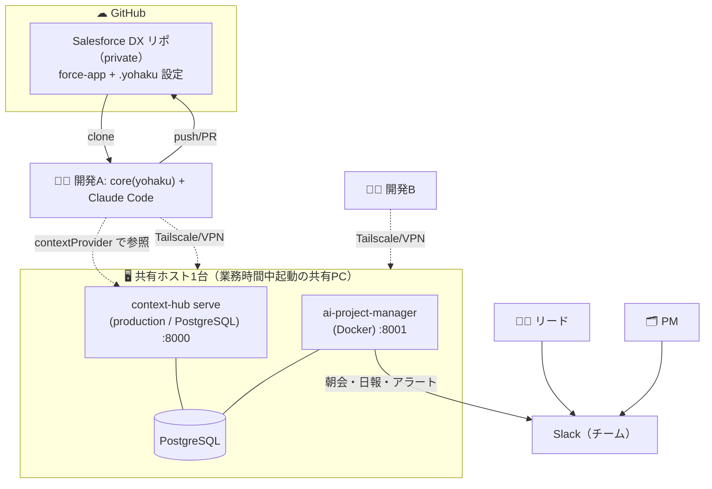
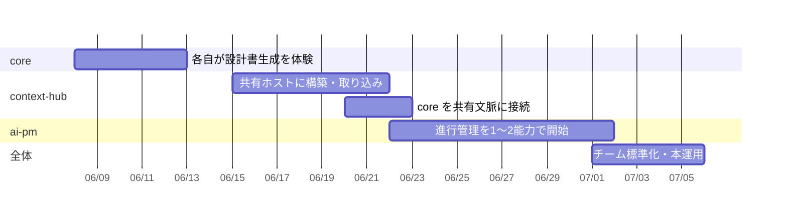
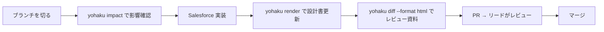

# ベストプラクティス導入プレイブック

core / context-hub / ai-project-manager を **3 つまとめて、推奨構成で導入・連携・運用する**ための実践ガイドです。
「実際にチームで回すとこう動く」が鮮明に湧くよう、具体的なシナリオ・ロードマップ・時間割で示します。

!!! abstract "このページのゴール"
    - 推奨の **リファレンス構成**（どこに何を置き、どう繋ぐか）が分かる
    - **4 週間の導入ロードマップ**と、各週の具体的な手順が分かる
    - 導入後の **日次・週次の運用フロー**と **1 日の時間割**がイメージできる
    - 誰が・いつ・どこを見るか（役割別の運用）が分かる

---

## 想定シナリオ（このページの主人公）

具体的にイメージできるよう、次のチームを例に進めます。

> **株式会社サンプルの Salesforce 受託開発チーム（5 名）**
>
> - **リード（PL）**: 1 名 — 設計レビューと進行の最終判断
> - **開発**: 3 名 — Salesforce 実装、設計書の更新
> - **PM**: 1 名 — 進行管理・顧客とのやり取り
> - 案件: 顧客 A の「基幹システム刷新」。Slack / Backlog で日々やり取りがある
> - 環境: 社内は **Windows** 中心。**専用の常時起動サーバは無い**ので、業務時間中に起動している **Windows の共有 PC を 1 台**ホストに充てる。各自は Windows 業務 PC、チャットは Slack

このチームが「属人化した仕様・散らばった文脈・手作業の進行管理」を解消するのがゴールです。

---

## 1. リファレンス構成（推奨アーキテクチャ）

**「設計の正本は Git、文脈と実行は共有サービス1台、各自は core をローカルに」** が推奨形です。



| 何を | どこに | なぜ |
|---|---|---|
| **Salesforce メタデータ + `.yohaku` 設定** | GitHub **private** リポ | 設計の正本。差分レビュー・履歴が活きる |
| **context-hub（文脈）** | 共有ホスト1台（`production`） | 顧客機密はオンプレに留める。全員が同じ文脈を見る |
| **ai-project-manager（進行管理）** | 同じ共有ホスト（Docker） | 実行履歴・結果を1か所に集約 |
| **core（`yohaku`）** | 各開発者の業務 PC（Windows / Mac） | 設計書生成は手元で。共有 context-hub を参照 |
| **リモート接続** | Tailscale 無料 / 社内 VPN | 共有ホストを安全に共有（インターネット直公開しない） |
| **通知** | Slack（＋監査用に local_file） | 対話的に回せて取りこぼしにくい |

!!! tip "なぜこの形か"
    顧客データ（context-hub の中身）は**機密**なので Git に載せず、**1台の共有サービスに皆が接続**して共有します。
    設計の正本（テキスト）は Git でレビュー。詳しい根拠は [バージョン管理 / チーム共有](../strategy/version-control.md)。

!!! note "専用の常時起動サーバは不要"
    ai-pm のスケジュール（朝会 09:00 〜 総括 17:30）は**業務時間内**に収まります。そのため**24時間稼働のサーバは必須ではなく、業務時間中に起動している共有 PC を 1 台**ホストに充てれば十分です。
    既存の業務 PC を 1 台「共有ホスト役」にする／使っていないデスクトップを充てる、で始められます（追加ハード購入は不要）。夜間に取り込みを回したい場合のみ、その PC を就業後もスリープさせない設定にします。

---

## 2. 導入ロードマップ（4 週間）

一気に全部入れず、**価値が出る最小から段階的に**広げます。



| 週 | フェーズ | 到達点（Done の目安） |
|---|---|---|
| **Week 1** | core 単独 | 各自が `yohaku` で設計書を生成し、PR でレビューできる |
| **Week 2** | 共有 context-hub | 共有ホストで取り込みが回り、チームが VPN で接続できる |
| **Week 2-3** | 連携 | core の `contextProvider` が共有 context-hub を指し、文脈つきで設計できる |
| **Week 3-4** | ai-pm | 朝会・日報が Slack で自動で回り始める（まず2能力） |
| **Week 4+** | 標準化 | 新規案件にテンプレ展開、バックアップ・監査を定常運用 |

---

## 3. 詳細セットアップ手順（連携込み・この順で）

!!! info "OS の前提（Windows 基準・Mac/Linux は読み替え）"
    社内 PC は **Windows** 前提でコマンドを記載します。`npm` / `pipx` / `git` / `docker` / `yohaku` / `context-hub` などは**どの OS でも共通**で、差が出るのは下記くらいです。

    | 操作 | Windows (PowerShell) | macOS / Linux |
    |---|---|---|
    | ファイルコピー | `copy a b` | `cp a b` |
    | ファイル内検索 | `Select-String 語 file` | `grep 語 file` |
    | venv 有効化 | `.venv\Scripts\Activate.ps1` | `source .venv/bin/activate` |
    | パス区切り | `C:\path\to\…` | `/path/to/…` |

    **共有ホスト（Windows）で ai-pm を動かすには Docker Desktop + WSL2 が必要**です（Windows 向け詳細は [ai-pm デプロイ](../ai-project-manager/deploy.md)）。

### Step 1 — core を各開発者の PC へ（Week 1）

```bash
npm install -g @yohakuforce/core@latest
yohaku --version          # 0.6.0
cd <Salesforce DXプロジェクト>
yohaku init --bootstrap --profile standard
yohaku graph build && yohaku render --format md,html
yohaku serve --port 4000 --watch    # ブラウザで設計書プレビュー
```

`docs/generated/` をコミットして PR レビュー。再生成物（`graph.sqlite` 等）は `.gitignore`（[詳細](../strategy/version-control.md)）。

### Step 2 — 共有ホストに context-hub（Week 2）

共有ホスト役の PC で（`production` プロファイル・PostgreSQL）:

```powershell
pipx install "yohakuforce-context-hub[embedding]"
cd <作業フォルダ>                  # 例: C:\yohakuforce\context-hub
context-hub init --profile production
context-hub migrate
# ★ init が表示する DEV_API_KEY を控える（Step 4 で AI-PM に使う）
#   後から確認: Select-String DEV_API_KEY .env   （Mac/Linux は grep DEV_API_KEY .env）
context-hub serve --host 0.0.0.0 --port 8000     # LAN/VPN 内のみに公開
```

ブラウザで `http://<host>:8000/admin` → DEV_API_KEY を貼る → **Sources タブで案件プロジェクト作成** → Slack / Backlog を設定して取り込み（[取り込み](../context-hub/ingest.md)）。

### Step 3 — 安全なリモート接続（Week 2）

共有ホストと各自の PC に **Tailscale（無料）** を入れてメッシュ接続。これで `http://<tailscale-ip>:8000` に社内メンバーだけが暗号化経路で到達できます（インターネットに開けない）。

### Step 4 — core を共有 context-hub に接続（Week 2-3）

Salesforce リポの `.yohaku/config.json` で contextProvider を共有 context-hub に向けます（**この1行が連携の肝**・Git 管理）。

```json
{
  "contextProvider": {
    "type": "context-hub",
    "baseUrl": "http://<tailscale-ip>:8000/api/v1"
  }
}
```

これで各開発者の `yohaku` / Claude Code が、**チーム共有の最新文脈を踏まえて** Salesforce 設計・実装できます（[core 設定](../core/configuration.md)）。

### Step 5 — ai-project-manager（Week 3-4）

同じ共有ホストで（context-hub を起動したまま）:

```powershell
git clone https://github.com/yohakuforce/ai-project-manager.git
cd ai-project-manager
copy .env.example .env       # Mac/Linux は cp .env.example .env
```

`.env`（要点）:

```env
DB_PASSWORD=<強いパスワード>
CONTEXT_HUB_BASE_URL=http://host.docker.internal:8000/api/v1
CONTEXT_HUB_API_KEY=<Step 2 で控えた DEV_API_KEY と同値>   # ★一致必須
CONTEXT_HUB_USE_MOCK=false
NOTIFICATION_CHANNEL=slack        # チーム運用は Slack 推奨
SLACK_BOT_TOKEN=xoxb-...
SLACK_NOTIFICATION_CHANNEL=#proj-alerts
LLM_PROVIDER=local                # 下記「LLM の選び方」を参照
LOCAL_LLM_BASE_URL=http://host.docker.internal:11434/v1
```

```bash
docker compose up --build         # db / app(8001) / migrate
```

`/register` でメンバー登録（Slack の `external_id` を設定）、`/settings` で配信時刻などを調整。

!!! warning "LLM の選び方（Docker の現実）"
    ai-pm をコンテナで動かす場合、`claude-code`/`antigravity` 等の **CLI 系はコンテナ内に CLI が無いと動きません**。推奨は次のいずれか:

    - **`local`**：ホストにローカル LLM（Ollama 等）を立て `host.docker.internal:11434/v1` を指す（オフライン・無料）
    - **ai-pm をホスト直起動**して `claude-code` / `antigravity`（サブスク）を使う

    まず `LLM_PROVIDER=mock` で疎通確認 → 実 LLM へ、が安全です（[LLM プロバイダ](../ai-project-manager/llm-providers.md)）。

---

## 4. 運用フロー（導入後の回し方）

### 日次（自動で回るサイクル）

ai-pm のスケジューラが既定で回します（時刻は `/settings` で調整可・順序は固定）。

| 時刻 | 何が起きる | 誰が見る |
|---|---|---|
| **09:00** | スタンドアップ（前日の日報・課題更新・アサインをレビュー、問題タスクに入替案） | リード / PM が Slack で確認 |
| **日中** | 開発は core で実装・設計書更新、Claude Code が共有文脈を参照 | 開発 |
| **14:00** | 日報テンプレを各メンバーへ配信 | メンバーに Slack DM |
| **17:00** | 未提出者へ催促 ＋ リーダーへ未提出者一覧 | メンバー / リード |
| **17:30** | 当日総括 ＋ リーダー確認ゲート | リードが「確認」操作 |
| **確認後** | `final_analysis`（全体ステータス分析・未割当の DRAFT アサイン） | リード / PM |
| **30 分毎** | アラートスキャン（遅延・過負荷・未回答） | リード（`#proj-alerts`） |

詳細は [7 つの能力](../ai-project-manager/capabilities.md) / 配信形式は [出力先](../ai-project-manager/notifications.md)。

### 開発者の1イテレーション（core）



### 週次（人がやる運用）

- **設計レビュー会**: `yohaku diff` の差分意味づけを見ながら、今週の変更をレビュー。
- **バックアップ**（共有ホスト・自動化推奨）: `pg_dump | gpg -c` を社内ストレージへ。
- **棚卸し**: アラートの傾向、未提出が多いメンバー、ボトルネックの確認。

---

## 5. ある1日の流れ（タイムスケジュール例）

具体的にイメージできるよう、ある火曜日を時系列で。

| 時刻 | リード | 開発A | PM |
|---|---|---|---|
| 09:00 | Slack でスタンドアップを確認。入替案を1件承認 | — | スタンドアップで全体感を把握 |
| 09:30 | — | `/onboard` 不要、`yohaku impact SObject:Order__c` で影響確認 → 実装開始 | 顧客 A へ進捗連絡 |
| 11:00 | アラート「要件定義レビューが期日超過(high)」を確認 → 担当に声かけ | — | — |
| 14:00 | — | 日報 DM が届く。あとで回答 | — |
| 15:00 | 開発B の PR を `yohaku diff --format html` でレビュー | 設計書を `yohaku render` で更新し PR | — |
| 17:00 | 未提出者一覧（1名）を確認 | 催促 DM → 日報を提出 | — |
| 17:30 | 当日総括を確認し**「確認」**を押す → 全体ステータス分析が走る | — | 全体ステータスを見て翌日の段取り |

> ポイント: **定型の連絡・集約は AI が回し、人は「判断（承認・レビュー・声かけ）」に集中**できます。

---

## 6. 役割別の「どこを見るか」

| 役割 | 主に見る / やること |
|---|---|
| **開発** | core で設計書生成・`impact`/`diff`、共有 context-hub を参照して実装、PR、日報 DM に回答 |
| **リード（PL）** | 朝会・`#proj-alerts`・17:30 の確認ゲート、`yohaku diff` で設計差分レビュー |
| **PM** | 全体ステータス、未提出状況、顧客連絡。必要なら Google Sheets で集計ビュー |
| **インフラ / 情シス** | 共有ホスト・Tailscale・バックアップ・鍵配布（共有金庫） |

---

## 7. うまく回っているかの目安（KPI）

- 設計書を**手で書く時間**が減った（core 導入の効果）
- 「あの件どこ？」の**探し物**が減った（context-hub の効果）
- 日報提出率・アラート対応リードタイム（ai-pm の効果）
- 朝会・催促・総括の**手作業がゼロ**になった

---

## 導入チェックリスト

=== "Week 1（core）"

    - [ ] 全員 `yohaku --version` が 0.6.0
    - [ ] `graph build && render` が通り、設計書を PR でレビューできた
    - [ ] 再生成物を `.gitignore`、`docs/generated/` をコミット

=== "Week 2（context-hub）"

    - [ ] 共有ホストで `context-hub serve`（production）稼働
    - [ ] Slack/Backlog の取り込みが回る
    - [ ] Tailscale でチームが接続できる
    - [ ] `.yohaku/config.json` の contextProvider を共有 URL に向けた

=== "Week 3-4（ai-pm）"

    - [ ] ai-pm が context-hub に接続（**鍵一致**）
    - [ ] まず `mock` で疎通 → Slack 配信に切替
    - [ ] `/register` でメンバー登録、確認ゲートの運用ルールを決めた
    - [ ] バックアップ（`pg_dump | gpg`）を自動化

---

## 関連ページ

- 個別の導入手順 → [クイックスタート](../getting-started/install.md)
- 共有・機密の考え方 → [バージョン管理 / チーム共有](../strategy/version-control.md)
- 段階導入の詳細 → [プロジェクト導入戦略](../strategy/adoption.md)
- 各製品の詳細 → [core](../core/index.md) / [context-hub](../context-hub/index.md) / [ai-project-manager](../ai-project-manager/index.md)
