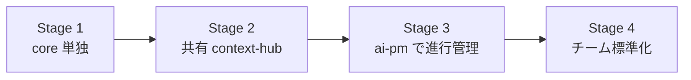

# プロジェクト導入戦略

ツールを「入れる」ことと「定着させる」ことは別物です。ここでは、Salesforce 開発チームに
余白フォース Suite を**小さく始めて確実に広げる**ための段階的ステップと勘所をまとめます。

!!! abstract "基本方針"
    **一気に全部入れない。** 価値が出る最小単位（core 単独）から始め、痛みが顕在化したら次の層を足す。
    各段階で「誰が・何を・どう使うか」を 1 つに絞る。

---

## 導入の 4 ステージ

### Stage 1 — core 単独で「設計書の自動生成」（1人〜小チーム / 数日）

最初の価値は core だけで出ます。サーバ不要・他製品に依存しません。

- **やること**: 既存の Salesforce プロジェクトで `yohaku init` → `graph build` → `render --format md,html`。
- **得られる価値**: 属人化していた仕様が、メタデータから**決定的に**設計書になる。レビューが速くなる。
- **共有**: 生成した `docs/generated/` を Git にコミットして PR でレビュー（[戦略](version-control.md) 参照）。
- **撤退コスト**: ほぼゼロ（CLI を消すだけ）。だから最初に試すのに最適。

!!! tip "成功の目安"
    「設計書を手で書く時間が減った」「レビューで仕様の認識ズレが減った」を 1〜2 案件で実感できたら次へ。

### Stage 2 — 共有 context-hub で「文脈をチームに」（チーム / 1〜2週間）

「あの案件の Slack のやり取り / Backlog のチケット、どこだっけ？」が増えてきたら context-hub。

- **やること**: 社内の共有マシン 1 台（業務時間中起動で可・専用サーバ不要）に context-hub（`production` プロファイル）を立て、
  Slack/Backlog/Redmine/Gmail を取り込む。チームは Tailscale/VPN で接続。
- **連結**: core の `.yohaku/config.json` の `contextProvider` を共有 context-hub に向け、
  **設計を「共有された文脈」を踏まえて**行えるようにする。
- **得られる価値**: 顧客文脈が 1 か所に集約され、AI（Claude Code 等）が即座に参照できる。
- **データ境界**: 顧客データはこのホストに留まる（[戦略](version-control.md) の層 B）。

### Stage 3 — ai-project-manager で「進行管理を自動化」（PM + チーム / 2〜4週間）

朝会・日報・催促・総括などの**定型的な進行管理の手間**が見えてきたら ai-pm。

- **やること**: 同じ共有ホストに ai-pm（Docker）を立て、context-hub に接続（`CONTEXT_HUB_API_KEY` = `DEV_API_KEY`）。
  まず `LLM_PROVIDER=mock` で疎通 → 実 LLM（サブスク/ローカル）へ。
- **進め方**: いきなり全 7 能力を回さず、**まず 1〜2 能力**（例: 朝会と日報）から。通知は `local_file` で安全に開始。
- **得られる価値**: 定型連絡が自動化され、人は判断と例外対応に集中できる。
- **ガバナンス**: リーダー確認ゲート（`final_analysis` は人の確認で発火）で「AI が勝手に進めない」設計。

### Stage 4 — チーム標準化（全体 / 継続）

- リポ構成・`.gitignore`・`contextProvider` を**テンプレ化**して新規案件に展開。
- 監査ログ + 暗号化バックアップを定期運用に。
- オンボーディング資料としてこのヘルプを共有。

---

## 役割分担の目安

| 役割 | 主な担当 |
|---|---|
| **開発者** | core で設計書生成、共有 context-hub を参照して実装、PR レビュー |
| **テックリード** | リポ構成・`.gitignore`・`contextProvider` の標準化、設計差分レビュー |
| **PM / 進行管理** | ai-pm の設定（時刻・通知先）、リーダー確認ゲートの運用 |
| **インフラ / 情シス** | 共有ホスト・VPN・バックアップ・鍵配布（共有金庫） |

---

## アンチパターン（避けたい進め方）

!!! warning "やりがちな失敗"
    - **いきなり 3 製品を全部・全機能で導入** → 学習コストが集中し定着しない。Stage 1 から。
    - **顧客データを Git に push** → セキュリティ境界を破壊。共有サービスで持つ（[戦略](version-control.md)）。
    - **`graph.sqlite` や DB をコミット** → リポ肥大・マージ地獄。再生成物は `.gitignore`。
    - **ai-pm を全能力フル稼働で開始** → 通知が溢れて現場が嫌う。1〜2 能力 + `local_file` から。
    - **共有サービスをインターネットに直公開** → 漏洩リスク。VPN/LAN 内に限定。
    - **鍵を README や `.env.example` にベタ書き** → 流出。共有金庫で配布。

---

## チェックリスト

=== "Stage 1（core）"

    - [ ] `yohaku --version` が 0.6.0
    - [ ] `yohaku graph build && yohaku render --format md,html` が通る
    - [ ] `docs/generated/` をコミット、再生成物を `.gitignore`
    - [ ] 1〜2 案件で「設計書の手間が減った」を確認

=== "Stage 2（context-hub）"

    - [ ] 共有ホストで `context-hub serve`（production）が稼働
    - [ ] Slack/Backlog 等の取り込みが動く
    - [ ] チームが VPN/Tailscale で接続できる
    - [ ] core の `contextProvider` を共有 URL に向けた

=== "Stage 3（ai-pm）"

    - [ ] ai-pm が context-hub に接続（鍵一致）
    - [ ] まず 1〜2 能力 + `local_file` 通知で開始
    - [ ] リーダー確認ゲートの運用ルールを決めた
    - [ ] 監査ログ + バックアップを設定

---

関連: [バージョン管理 / チーム共有](version-control.md) ・ [クイックスタート](../getting-started/install.md)
